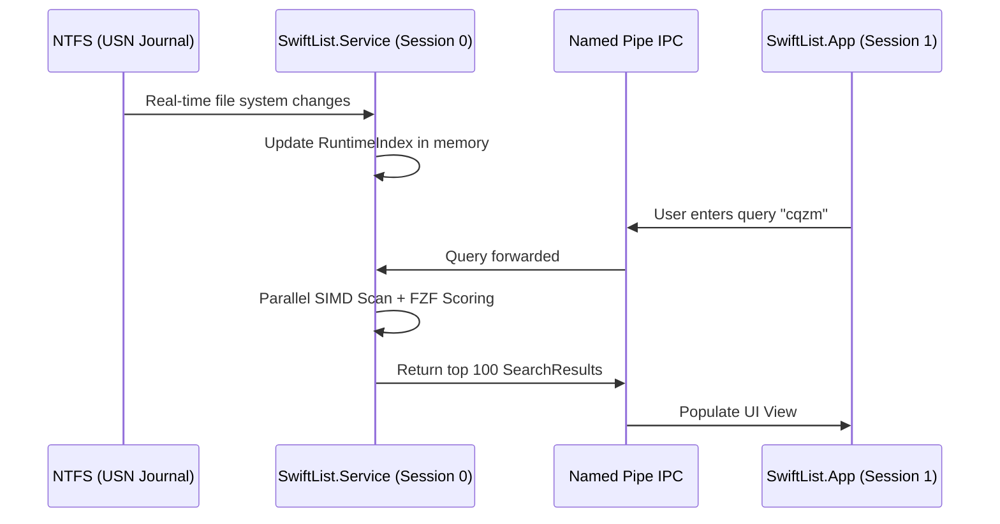

# SwiftList Codebase Architecture & Design Document

This document provides a comprehensive overview of the SwiftList architecture, project layout, data structures, indexing system, search pipeline, SIMD vectorizations, and development guidelines. It is designed to help maintainers and AI agents quickly understand the codebase.

---

## 1. System Overview & Flow

SwiftList is a lightweight, ultra-fast global desktop search and launcher utility for Windows. Its core architecture relies on:
1. **Windows Service (`Session 0`)**: Reads NTFS **USN (Update Sequence Number) Journals** via low-level Win32 APIs for instant indexing and tracks disk modifications in real-time.
2. **WPF Application (`Session 1`)**: Displays the GUI and runs low-level keyboard hooks.
3. **Named Pipe IPC**: Passes search commands and hotkey activations between the WPF user application and the background service.

### System Interaction Diagram



---

## 2. Solution Structure & Project Layering

The codebase is split into two visual studio solution files:
* **`SwiftList.slnx`**: Contains the core program components.
* **`SwiftList.Plugins.slnx`**: Contains core and third-party extension plugins.

### Main Layering

### 2.1 SwiftList.Core
The heart of the application, managing storage, indexing, FZF matching, and communication.
* `SearchIndex/RecordIndex/RuntimeIndex.cs`: Stores metadata for all indexed files.
* `SearchIndex/RecordIndex/UpdateExtensions.cs`: Handles real-time incremental index updates (upsert/delete).
* `SearchIndex/Fzf/`: Features a custom C# port of the FZF fuzzy matching algorithm, including scoring (`FzfScoring.cs`), exact matches (`FzfExactMatcher.cs`), fuzzy matching DP (`FzfFuzzyMatcher.cs`), and top-N heap (`FzfTopN.cs`).
* `Ipc/`: Standard named-pipe communication server and client.

### 2.2 SwiftList.Service
A Windows background service executing in **Session 0**.
* `SearchEngineInitializer.cs`: Initializes index caches for drives and spawns catch-up threads.
* `JournalReader.cs`: Directly reads the raw NTFS USN Journal records.
* `Monitor.cs`: Listens for real-time file system change notifications and applies them to `RuntimeIndex`.
* `Service.cs`: Entry point for Windows Service lifecycle hooks.

### 2.3 SwiftList.App
The WPF Desktop user interface executing in the interactive **Session 1**.
* `App.xaml.cs`: Application lifecycle, named-pipe server for single-instance enforcement, and loading settings/plugins.
* `QuickSearchWindow.xaml`: Main search launch dialog.
* `InlineSearchWindow.xaml`: Overlays Explorer dialog boxes using native Windows positioning hook coordinates.
* `Services/ThemeManager.cs` & `TranslationManager.cs`: Controls styling themes (Light/Dark) and dynamic translation switching.

### 2.4 SwiftList.PluginSdk & Plugins
A highly decoupled plugin ecosystem:
* `PluginSdk`: Defines interfaces for Actions (`ISearchResultAction`), instant results (`IInstantResultProvider`), and dynamic context menus (`IDynamicActionProvider`).
* `Plugins/PinyinAlias`: Leverages `TinyPinyin` to generate Hanzi-to-Pinyin alias lookups.
* `Plugins/CoreExtensions`: Standard plugins including a calculator (`CalculatorInstantProvider`) and an environment variable path resolver (`EnvironmentVariableInstantProvider`).

---

## 3. Data Storage & Memory Optimization

To index over 3,000,000 files in under **40 MB of RAM**, SwiftList utilizes a highly optimized **Structure of Arrays (SoA)** memory layout in `RuntimeIndex.cs`.

### Index Layout
Rather than using heavy C# class instances for each file record, metadata is stored in flat primitive collections:
```csharp
private readonly List<ulong> _ids;               // NTFS File Reference Number (FRN)
private readonly List<int> _parentIndexes;       // Pointer index to the parent record
private readonly List<int> _nameIds;             // String table ID
private readonly List<byte> _flags;              // File flags (Directory, Deleted, SystemRoot, etc.)
private readonly List<ulong> _charMasks;         // Bitwise character mask for rapid skipping
```

* **`NameTable`**: Deduplicates and packs path names. Folder and file names are stored as pooled IDs to prevent string duplication.
* **`CharMasks`**: Stores a 64-bit character presence bitmask of the filename. Letters `a-z`, digits `0-9`, and common symbols are mapped to bits.
  * *Alias Override*: If a record contains Chinese characters and has a Pinyin alias, its mask is set to `ulong.MaxValue` to ensure it always passes character filtering.
  * *Deletion Override*: Deleted files have their masks set to `0` to instantly filter them out.

---

## 4. Search Pipeline & Hardware-Level Vectorization (SIMD)

SwiftList's search pipeline is designed for massive datasets. When a query is executed, it runs the following stages:

```
[User Query] -> [Build Char Mask] -> [Parallel SIMD Contiguous Scan] -> [FZF Fuzzy Match / DP] -> [SIMD Top-N Heap] -> [Radix Sort] -> [UI]
```

### 4.1 AVX2 Candidate Filter (`NameSearchExtensions.cs`)
* Scans all `CharMasks` contiguously in parallel chunks of 8192 using CPU worker threads.
* Loads 4 masks into a `Vector256<ulong>`.
* Performs a bitwise AND and equality check: `(maskVec & queryVec) == queryVec`.
* Extracts the match state via `ExtractMostSignificantBits()`.
* **Fast-Path**: If the result is `0` (which is true for 99.9% of blocks in typical queries), **all 4 candidates are skipped with a single branch instruction**.

### 4.2 Span-Based Boundary Locator (`FzfScoring.FindFuzzyScope`)
* Finds the substring scope in which the FZF pattern matches.
* Replaces original scalar scans with .NET's internally vectorized `IndexOf`, `IndexOfAny`, `LastIndexOf`, and `LastIndexOfAny` APIs.
* **Result**: **`9.9x`** speedup.

### 4.3 SoA Vectorized Eviction Heap (`FzfTopN.cs`)
* Keeps track of the best results.
* Implements a custom parallel search on the `_sortKeys` array using `Vector256.GreaterThan` and `Vector256.ConditionalSelect` to locate the index containing the worst score in the heap.
* Includes fallback checks for non-AVX2 CPUs (`Avx2.IsSupported`).
* **Result**: **`1.25x`** speedup.

---

## 5. Developer Guidelines & Architectural Constraints

When writing code or refactoring SwiftList, you **MUST** strictly adhere to the following rules:

### 1. Strict 300-Line Code File Limit
* **Rule**: To keep compilation fast and ensure maximum codebase readability, **every C# (`.cs`) and XAML (`.xaml`) file must remain strictly under 300 lines**.
* **Splitting Pattern**: If a file grows near 300 lines, you must extract helper classes, decouple logic, or split files.
  * *Example*: `PipeRequestBinarySerializer.cs` was split by separating IPC model structures (`IpcMessage.cs`) and search request definitions (`SearchRequestMessage.cs`) into individual files.
  * *Example*: `NameSearchExtensions.cs` extracted candidate processing into a standalone `MatchAndAdd` method to remain at 259 lines.

### 2. High-Performance APIs
* In hot search loops, always extract list memory spans using `CollectionsMarshal.AsSpan` to avoid index bounds-checking overhead.
* Avoid string allocations (`string.Concat`, `.ToLower()`) in loops. Pass around `ReadOnlySpan<char>` and work with character classes statically.

### 3. Visual Aesthetics (UI Design)
* Ensure premium interface aesthetics by matching the unified Harmony Dark/Light themes. Avoid default raw browser/system colors. Use Outfit/Inter typography, smooth gradients, and glassmorphism.
* Ensure animations and micro-interactions run smoothly on the UI thread without blocking search computations (which must always be delegated to task pools).
