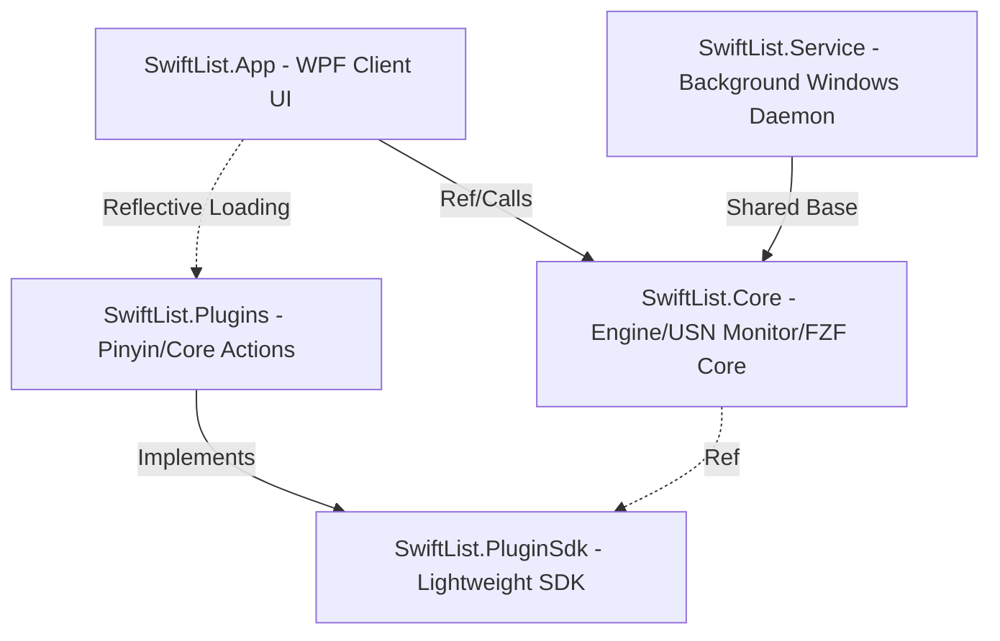

# ⚡ SwiftList

[简体中文](README_ZH.md) | English

SwiftList is an ultra-lightweight, high-performance, and highly extensible global search and productivity launcher for Windows desktop built on **.NET 10.0 (WPF)** and NT Services. It is designed to be a modern, sleek, and open-source alternative to **Everything** and **Listary**.

By directly parsing NTFS **USN Journal (Update Sequence Number)** logs and interacting with system file systems via Win32 low-level APIs, SwiftList achieves millisecond-level local file indexing and real-time synchronization. Coupled with high-performance C# SIMD vectorization and a fully decoupled plugin architecture, it provides an exceptionally smooth search experience for developers and power users on Windows.

---

## 🚀 Technical Highlights & Features

### 1. ⚡ Millisecond-Level Search & Real-Time Sync
* **NTFS USN Journal Indexing**: Interacts directly with NTFS via Win32 low-level APIs, bypassing the high I/O consumption and latency of recursive directory traversal. Indexing millions of files takes only a few seconds.
* **Low-Resource Background Daemon**: A standalone Windows Service `SwiftListService` runs in the background, listening to real-time USN changes to perform silent incremental synchronization with minimal memory usage.
* **Enterprise-Grade Network Drive Scanner**: Includes a parallel Directory Walker optimized for NAS/shared network drives, incorporating a custom-built Glob compiler that translates Glob exclusion patterns into high-performance Regex matches on the fly (exclusions apply instantly without restart).

### 2. 🎯 FZF Fuzzy Matching & Pinyin Retrieval
* **Ported FZF Scoring Algorithm**: Integrates the famous FZF fuzzy match and score calculation logic, supporting multi-keyword fuzzy jump matches and intelligent relevance ranking.
* **Chinese Pinyin & Initials Search**: Features an embedded TinyPinyin parser. Typing `xx` or `xuexi` instantly retrieves files like "学习资料.xlsx" (Study Materials), aligning perfectly with Chinese users' search habits.
* **Dynamic Programming (DP) Highlighter**: Employs a DP-based match weight backtracker to highlight discrete characters matched in the fuzzy search, delivering a premium and precise visual response.

### 3. ⚡ Hardware-Level SIMD/AVX2 Vectorization
* **SIMD-Accelerated Scope Locator**: Replaces standard scalar character loops in the FZF search window with vectorized character scanning APIs, accelerating scope calculation by up to **9.9x**.
* **Top-N Eviction Heap Optimization**: Reorganizes the search result ranks from an Array of Structures (AoS) to a cache-friendly Structure of Arrays (SoA), using `Vector256.GreaterThan` and `ConditionalSelect` to locate worst-nodes, yielding a **1.2x - 1.3x** speedup.
* **3-Million Candidate Mask Filter**: Accelerates global contiguous name matching using AVX2 block scans and mask-reload alignment, achieving a **1.6x - 2.1x** speedup on directories containing over 3 million items.
* For more architectural details, see [ARCHITECTURE.md](ARCHITECTURE.md).

### 4. 🖥️ 3-in-1 Multidimensional Interaction
* **Quick Search Window (QuickSearchPanel)**: A classic, minimalist floating launcher panel. Supports global shortcuts (**Double-click the Ctrl key** to show/hide) and quick selection using `Ctrl+1` to `Ctrl+9` for blind operation.
* **Inline Explorer-Docked Window (InlineSearchPanel)**: An innovative overlay panel that automatically docks above Windows Explorer, system file open/save dialogs, or custom list views. Press `Tab` to trigger directory navigation and instant directory jumps.
  * **Native Explorer Focus Adaption**: Optimizes keyboard hooks on Windows 10/11, adapting flawlessly to explorer views such as `DirectUIHWND` and `SHELLDLL_DefView`.
* **Control Panel & Settings (SettingsWindow)**: Visually manages exclusions, network drives, and background service status.

### 5. 🔍 Multi-Column List Search Support
* **`SysListView32` & `ListBox` Hooking**: Seamlessly intercepts native standard `SysListView32` and `ListBox` controls. When the inline panel attaches to these list components, users can filter list items interactively.
* **Multi-Column Data Merging**: Automatically retrieves text from all available columns. Columns are joined backend-side using Tab (`\t`) delimiters, allowing the FZF algorithm to match queries across columns simultaneously (e.g. typing username or PID in Task Manager filters the row).
* **Elegant Visual Separators**: Custom XAML template parses tab-delimited items via a `SplitColumnsConverter` and renders them with horizontal layout wrappers using premium visual dividers (`  │  `).
* **Shift + Mouse Wheel Horizontal Scrolling**: Multi-column text fields display horizontal scrollbars if they exceed the width. Supports Shift + Mouse Wheel for smooth horizontal panning via an attached behavior (`ScrollViewerHelper`).

### 6. 👁️ Modular File QuickLook (File Preview)
* **Instant File Preview**: Supports seamless quick file content previews for folders, images, text documents, and PE binaries without launching heavy external editors.
* **Smart Selection Sync**: Selection change in both the Quick Search Window (`QuickSearchWindow`) and the Full Search Window (`SearchWindow`) automatically loads or closes the preview pane. Non-previewable items like applications or section headers automatically hide the preview.
* **Custom Shortcuts**: Press `Function Key Modifier + Space` or `Function Key Modifier + P` to toggle the preview window. The modifier key can be customized by the user in settings.
* **Smooth Text Panning**: The text previewer supports `Shift + Mouse Wheel` to horizontally pan wide logs or source code files.

### 7. 🛡️ Target Focus & UAC Exclusion Guard
* **UAC Prompt Exclusion**: Prevents global hotkeys or inline overlays from intercepting keys when a system UAC elevation prompt dialog is in the foreground.
* **Smart Input Focus Detection**: Automatically skips hook interception when a text input control (like native `Edit`, `RichEdit`, or custom `TextBox` controls) is focused, or when a blinking cursor caret is active, ensuring normal text typing is never interrupted.

### 8. 🎨 Theme Customization & i18n localization
* **Dynamic Themes**: Supports visual theme injection via `IThemeProvider` (built-in themes include Nord, Sakura, Cyberpunk, Light, and Dark). Supports dynamic recoloring, path fill bindings, and active selection text foreground inheritance.
* **Internationalization**: Leverages `ITranslationProvider` to support dynamic localization resource loading (e.g., English `en-US` and Simplified Chinese `zh-CN`).

### 9. 🧩 Fully Decoupled Plugin Ecosystem
Features a lightweight, reusable **Plugin SDK** that enables seamless third-party extensions. The core project currently ships with five built-in extension groups:
* **`ISearchResultAction` (Actions Menu)**: Defines right-click/Tab actions for search results, such as "Open File Location" or "Copy Path". It also registers dedicated context-aware commands inside the inline docked window.
* **`IDynamicActionProvider` (Dynamic Menu)**: Interacts with the native Windows shell to reproduce Windows Right-Click Context Menus with pixel-perfection.
* **`IInstantResultProvider` (Instant Evaluations)**:
  * **Scientific Calculator**: Parses arithmetic expressions in real-time, supporting nested brackets, scientific functions, and base conversions (e.g., `255 to hex` 👉 `0xFF`). Press `Tab` to autocomplete the result.
  * **Environment Variables Expansion**: Instantly expands Windows environment variables (e.g., `%appdata%`). If the resolved path exists, Enter opens it; otherwise, it defaults to copy-to-clipboard.
  * **Command Runner**: Instantly executes system command lines.
  * **Bing Translator**: Input `tr hello` or `tr 你好` to instantly display the translation result and the detected source language. Press Enter or click to copy. The source language is automatically detected, and the target language is automatically set to the current app interface language. If the source language matches the target language, it automatically translates to English.
  * **Web Search**: Type engine prefixes followed by keywords to search instantly in your default web browser. Supported prefixes: `gg <keyword>` (Google), `bd <keyword>` (Baidu), `bing <keyword>` (Bing), `gh <keyword>` (GitHub), `wiki <keyword>` (Wikipedia).

---

## 📖 Detailed User Manual

### 1. Wakeup & Basic Interactions
* **Triggering Search Panel**: In any environment, **double-click the `Ctrl` key** rapidly to show the floating Quick Search Window at the center of the screen. Double-click `Ctrl` again or press `Esc` to hide it.
* **Blind Selection**: 
  * Shortcuts indicator (`Ctrl+1` through `Ctrl+9`) are permanently docked on the right side of the list.
  * Instead of reaching for your mouse, simply press `Ctrl+number` to instantly open/trigger the corresponding result.
* **Copy File/Folder Entity (Ctrl+C)**: Select a file or folder in any search result list, press `Ctrl+C` to copy the actual file/folder entity directly to the clipboard and **automatically close the search window**, allowing you to paste it (`Ctrl+V`) directly inside Windows File Explorer.
* **Actions Menu**:
  * Select a search result and press `Tab` (or right-click) to open the actions menu.
  * Features high-frequency actions such as "Open", "Open Folder", "Run as Administrator", "Copy Path", and "Copy File".

### 2. Inline Explorer Overlay & Directory Navigation (Inline Search)
The Inline Search panel seamlessly docks onto native system file windows:
* **Smart Docking**: Whenever you open Windows Explorer or any standard system File Open/Save Dialog, SwiftList automatically overlays a thin "Inline Search Panel" at the top of that window.
* **Directory Jumping (Tab/Enter)**:
  * To jump folders inside Explorer, type keywords in the Inline Search bar.
  * Select your target folder and press Enter or `Tab`. Explorer will **instantly jump** to that folder, eliminating tedious manual navigation.
* **Save Dialog Redirection**:
  * This also applies to Save As dialogs (e.g., downloading files in a browser).
  * Type your target folder in the inline bar and hit Enter. The dialog will immediately redirect its saving destination, allowing you to save files to the correct place instantly.

### 3. Magic Commands & Instant Evaluations
SwiftList allows you to perform calculations, resolve paths, and invoke terminal commands directly from the main search bar:
* **Calculator & Base Conversion**:
  * Type any math expression (e.g., `(12 + 34) * 5`) and the evaluation result will display instantly.
  * Convert values between decimal and hexadecimal on the fly (e.g., `1024 to hex` or `0xFF to dec`). Press `Tab` to fill the input box with the result.
* **Environment Variables**:
  * Input Windows environment variables (e.g., `%temp%` or `%localappdata%`). SwiftList automatically expands the physical path. Hit Enter to open, or copy to clipboard if the path doesn't exist.
* **Inline Directory Commands**:
  When the Inline Search window is active, type these commands in the search bar and press Enter to perform actions **inside the active Explorer working directory**:
  * `touch <filename>`: Creates an empty file in the active folder (e.g., `touch index.js`).
  * `mkdir <foldername>`: Creates a new folder in the active folder (e.g., `mkdir src`).
* **Command Runner**:
  * **Standard Execution ($)**: Prefix with `$` (e.g., `$ping google.com`) to execute standard shell commands. The cmd terminal will stay open after execution.
  * **Elevated Execution (#)**: Prefix with `#` (e.g., `#net start mssqlserver`) to trigger Windows UAC elevation and execute the command as Administrator. The terminal stays open.

### 4. File QuickLook (File Preview)
* **Activating Preview**: Select any file or folder and press `Function Key Modifier + Space` or `Function Key Modifier + P` (e.g., `Alt + Space` if Alt is your Function Key Modifier) to pop up the premium side-docked QuickLook preview.
* **Selection Syncing**: Once activated, moving the selection up/down using arrow keys will dynamically update the preview content in real-time. If you highlight an application or section header, the preview automatically closes itself, and will automatically restore when you move back to a previewable file.
* **Modular Configuration**: Previewers are loaded dynamically as plugins. You can enable/disable individual preview providers (Folder, Image, Text, PE) on the "Plugin Management" settings page.

### 5. Auto Updates & Silent Upgrades
* **Auto Check Updates**: Enabling this in settings causes the App to silently fetch metadata of the latest GitHub Release on startup.
* **Auto Silent Update**:
  * **Permission Guard**: Due to Windows system security and service requirements, **non-administrator users cannot configure or enable Auto Silent Updates** (the checkbox is disabled).
  * **Prompt Before Update**: To prevent interrupting user workflow, the system shows a confirmation dialog before executing a silent update.
  * **Process Eviction Order**: To prevent file locks and upgrade failures, the batch updater (`portable-updater.bat`) terminates processes in a strict order: **Kill Main App ➔ Kill Hook Service process ➔ Elevated stop and unregister background `SwiftListService` daemon**. Once the files are unlocked, it overwrites files and restarts the service and client.

---

## 🛠️ Architecture

SwiftList splits its logic into highly-decoupled projects:

* **`SwiftList.slnx`**: Main Solution structure (App, Core, Service, PluginSdk).
* **`SwiftList.Plugins.slnx`**: Plugin SDK Solution structure (PinyinAlias, CoreExtensions).

---

## ⚡ Developer Guide

### 1. Requirements
* **OS**: Windows 10 / 11 (Non-Windows platforms are not supported due to native NTFS MFT/USN requirements).
* **IDE**: Visual Studio 2022 / JetBrains Rider.
* **Runtime**: .NET 10.0 SDK (WPF).
* **Packaging**: NSIS (Nullsoft Scriptable Install System) (required for generating the installer).

### 2. Build & Launch Scripts
We provide helper automation scripts in the repository root:
* **`build_and_run.bat`**:
  * Terminates active instances of SwiftList and hook helpers.
  * Elevated stop and unregisters the old NT service.
  * Recompiles both solutions and plugins.
  * Reinstalls and restarts the Windows service, then launches the WPF app.
* **`make.bat`**:
  * **Clean Builds**: Automatically deletes both `dist/` and `publish/` folders at start.
  * **Dynamic Versioning**: Extracts the latest semantic version from `App/App.csproj` and formats a 4-digit Windows PE version to pass to NSIS compilation.
  * **Release Compilation**: Publishes the App, Service, and Plugins in Release mode, cleans up PDBs, and compiles the modular NSIS script ([Installer/installer.nsi](Installer/installer.nsi)) using `/INPUTCHARSET UTF8` to generate the setup installer.
  * **Silent Dependency Installer**: The NSIS script automatically detects if the .NET 10.0 Windows Desktop Runtime is missing and performs a silent download (via BITS or curl fallback) and silent installation (`/install /quiet /norestart`) during setup.
  * **Output Products**: Packages the client into `dist/SwiftList-Portable.zip` and puts the installer into `dist/SwiftList-Setup.exe`.
  * **Post-build Cleanup**: Deletes the temporary `publish/` folder automatically.

---

## 🎁 Support & Donation

If you find SwiftList helpful, thank you very much for your support and sponsorship!

* **Tether USDT (TRC20)** Wallet Address:
  `TNDh3husX1trDW2ZPm4ZZYdoCoCRCZQXn5`

---

## 📜 License

This project is open-source and licensed under the **MIT License**.
