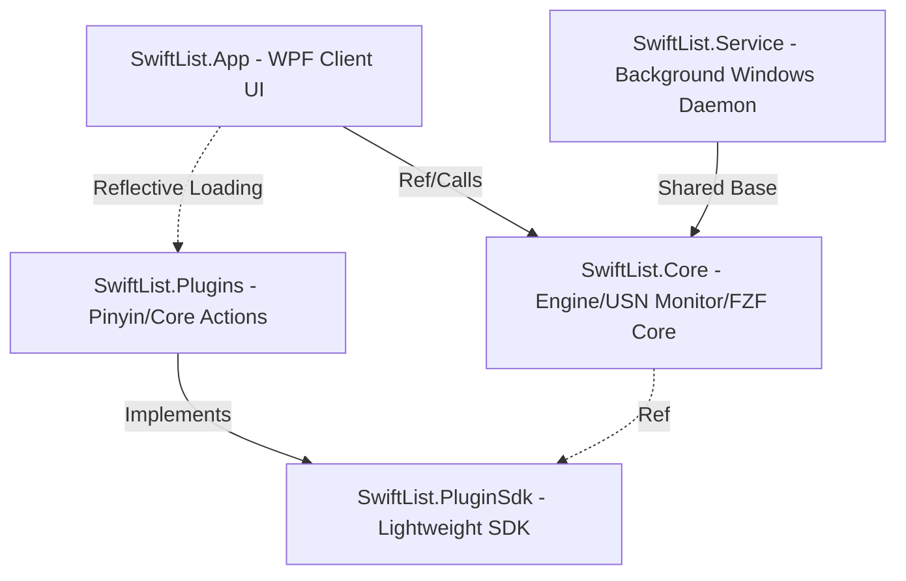

# SwiftList

[简体中文](README_ZH.md) | English

SwiftList is an ultra-lightweight, high-performance, and highly extensible global search and productivity launcher for Windows desktop built on **.NET 10.0 (WPF)** and NT Services. It is designed to be a modern, sleek, and open-source alternative to **Everything** and **Listary**.

By directly parsing NTFS **MFT (Master File Table)** and listening to the **USN Journal (Update Sequence Number)**, SwiftList achieves millisecond-level local file indexing and real-time synchronization. Coupled with high-performance C# vectorization and a fully decoupled plugin architecture, it provides an exceptionally smooth search experience for developers and power users on Windows.

---

## 🚀 Technical Highlights & Features

### 1. ⚡ Millisecond-Level Search & Real-Time Sync
* **NTFS USN Journal Indexing**: Interacts directly with NTFS via Win32 low-level APIs, bypassing the high I/O consumption and latency of recursive directory traversal. Indexing millions of files takes only a few seconds.
* **Low-Resource Background Daemon**: A standalone Windows Service `SwiftListService` runs in the background, listening to real-time USN changes to perform silent incremental synchronization with minimal memory usage.
* **Enterprise-Grade Network Drive Scanner**: Includes a parallel Directory Walker optimized for NAS/shared network drives, incorporating a custom-built Glob compiler that translates Glob exclusion patterns into high-performance Regex matches on the fly (exclusions apply instantly without restart).

### 2. 🎯 FZF Fuzzy Matching & Pinyin Retrieval
* **Ported FZF Scoring Algorithm**: Integrates the famous FZF fuzzy match and score calculation logic, supporting multi-keyword fuzzy jump matches and intelligent relevance ranking.
* **Chinese Pinyin & Initials Search**: Features a lightweight pinyin parser. Typing `xx` or `xuexi` instantly retrieves files like "学习资料.xlsx" (Study Materials), aligning perfectly with Chinese users' habits.
* **Dynamic Programming (DP) Highlighter**: Employs a DP-based match weight backtracker to highlight discrete characters matched in the fuzzy search, delivering a premium and precise visual response.

### 3. ⚡ Hardware-Level SIMD/AVX2 Vectorization
* **SIMD-Accelerated Scope Locator**: Replaces standard scalar character loops in the FZF search window with vectorized character scanning APIs, accelerating scope calculation by up to **9.9x**.
* **Top-N Eviction Heap Optimization**: Reorganizes the search result ranks from an Array of Structures (AoS) to a cache-friendly Structure of Arrays (SoA), using `Vector256.GreaterThan` and `ConditionalSelect` to locate worst-nodes, yielding a **1.2x - 1.3x** speedup.
* **3-Million Candidate Mask Filter**: Accelerates global contiguous name matching using AVX2 block scans and mask-reload alignment, achieving a **1.6x - 2.1x** speedup on directories containing over 3 million items.
* For more architectural details, see [ARCHITECTURE.md](ARCHITECTURE.md).

### 4. 🖥️ 3-in-1 Multidimensional Interaction
* **Quick Search Window (QuickSearchPanel)**: A classic, minimalist floating launcher panel. Supports global shortcuts (e.g., Alt+Space) and quick selection using Ctrl+1 to Ctrl+9 for blind operation.
* **Inline Explorer-Docked Window (InlineSearchPanel)**: An innovative overlay panel that automatically docks above Windows Explorer or system file open/save dialogs. Press `Tab` to trigger directory navigation and instant directory jumps.
  * **Native Explorer Focus Adaption**: Optimizes keyboard hooks on Windows 10/11, adapting flawlessly to explorer views such as `DirectUIHWND` and `SHELLDLL_DefView`.
* **Control Panel & Settings (SettingsWindow)**: Visually manages exclusions, network drives, and background service status.

### 5. 🎨 Theme Customization & i18n localization
* **Dynamic Themes**: Supports visual theme injection via `IThemeProvider` (built-in themes include Nord, Sakura, Cyberpunk, Light, and Dark). Supports dynamic recoloring, path fill bindings, and active selection text foreground inheritance.
* **Internationalization**: Leverages `ITranslationProvider` to support dynamic localization resource loading (e.g., English `en-US` and Simplified Chinese `zh-CN`).

### 6. 🧩 Fully Decoupled Plugin Ecosystem
Features a lightweight, reusable **Plugin SDK** that enables seamless third-party extensions. The core project currently ships with five built-in extension groups:
* **`ISearchResultAction` (Actions Menu)**: Defines right-click/Tab actions for search results, such as "Open File Location" or "Copy Path". It also registers dedicated context-aware commands inside the inline docked window:
  * **`touch <filename>`**: Creates an empty file in the active Explorer folder.
  * **`mkdir <foldername>`**: Creates a new folder in the active Explorer folder.
* **`IDynamicActionProvider` (Dynamic Menu)**: Interacts with the native Windows shell to reproduce Windows Right-Click Context Menus with pixel-perfection.
* **`IInstantResultProvider` (Instant Evaluations)**:
  * **Scientific Calculator**: Parses arithmetic expressions in real-time, supporting nested brackets, scientific functions, and base conversions (e.g., `255 to hex` 👉 `0xFF`). Press `Tab` to autocomplete the result.
  * **Environment Variables Expansion**: Instantly expands Windows environment variables (e.g., `%appdata%`). If the resolved path exists, Enter opens it; otherwise, it defaults to copy-to-clipboard.
  * **Command Runner**: Instantly executes system command lines. Prefix the command with **`$`** to run with standard user privileges in an interactive console, or with **`#`** to run with elevated Administrator privileges (CMD stays open for output inspection).

---

## 🛠️ Architecture

SwiftList splits its logic into highly-decoupled projects:



* **`SwiftList.slnx`**: Main Solution structure (App, Core, Service, PluginSdk).
* **`SwiftList.Plugins.slnx`**: Plugin SDK Solution structure (PinyinAlias, CoreExtensions).

---

## ⚡ Quick Start for Developers

### 1. Requirements
* **OS**: Windows 10 / 11 (Non-Windows platforms are not supported due to native NTFS MFT/USN requirements).
* **IDE**: Visual Studio 2022 / JetBrains Rider.
* **Runtime**: .NET 10.0 SDK (WPF).

### 2. Build & Launch
We provide helper automation scripts in the repository root:
* **`build_and_run.bat`**: Closes running client/daemon instances, stops the old service with elevated privileges, recompiles the solutions, restarts the Windows service, and starts the WPF app.
* **`make.bat`**: Compiles all release binaries and builds the NSIS installer (`SwiftList-Setup.exe` and `SwiftList-Portable.zip`).

For manual command-line building:
```powershell
# 1. Build the main application and core service
dotnet build SwiftList.slnx

# 2. Build the extensions
dotnet build SwiftList.Plugins.slnx
```

---

## 🎁 Support & Donation

If you find SwiftList helpful, thank you very much for your support and sponsorship!

* **Tether USDT (TRC20)** Wallet Address:
  `TNDh3husX1trDW2ZPm4ZZYdoCoCRCZQXn5`

---

## 📜 License

This project is open-source and licensed under the **MIT License**.
