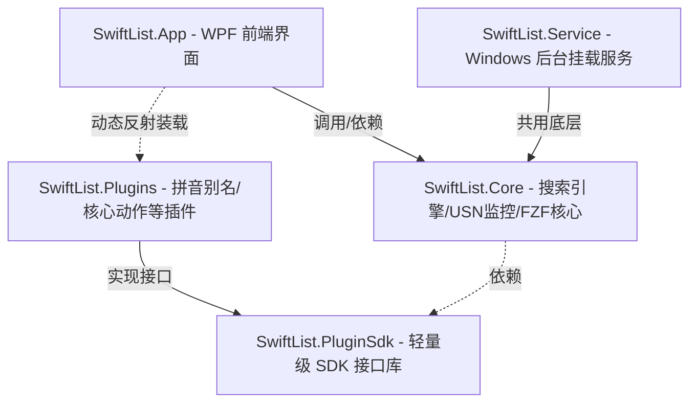

# SwiftList

简体中文 | [English](README.md)

SwiftList 是一款基于 **.NET 10.0 (WPF)** 开发的超轻量、极速且高度可扩展的 Windows 桌面全局搜索与效率启动工具，旨在成为 **Everything** 和 **Listary** 的现代化、高颜值、支持深度定制的开源替代方案。

它通过读取 NTFS 分区的 **USN Journal（更新序列号日志）**，实现了类似 Everything 的毫秒级本地文件索引与秒级全盘检索能力，并辅以高度流畅的交互体验和高度解耦的插件体系，为 Windows 平台开发者和重度系统用户提供极致流畅的全局办公加速体验。

---

## 🚀 核心技术与产品特性

### 1. ⚡ 毫秒级全盘检索与增量同步
* **NTFS USN 日志级检索**：直接通过底层的 Win32 API 读取 NTFS 文件系统的 USN 序列日志，彻底免去传统逐个文件递归扫描（Directory Walking）所带来的巨大 I/O 消耗与漫长等待，建索引只需数秒。
* **低功耗实时后台监控**：独立 Windows 后台服务 `SwiftListService` 负责监听 USN 变化，当文件被增删改移时，索引库在后台零感完成增量毫秒级同步，内存占用极低。
* **企业级网络驱动器索引**：专为网络驱动器（NAS / 局域网共享盘）深度定制了 Walk 文件树扫描器，支持智能并行扫描和自研的高效 Glob 排阻编译器（将 Glob 表达式动态编译为高效 Regex），排除规则支持即时修改并即时生效。

### 2. 🎯 FZF 模糊匹配与拼音首字母检索
* **深度移植 FZF 匹配算法**：深度移植了著名的 FZF 核心模糊匹配与评分算法，支持多关键词模糊跳配，确保搜索结果随心而动、智能排序。
* **全汉语拼音及首字母缩写检索**：内置高效的 TinyPinyin 分词与首字母映射存储索引。例如：输入 `xx` 或 `xuexi` 即可瞬间秒搜“学习材料.xlsx”，完美适应中文搜索习惯。
* **高精度 DP 动态高亮反馈**：应用基于动态规划（DP）和最佳匹配权重回溯的智能字符高亮渲染器，精准标红用户模糊打入的离散字符，视效极其细腻。

### 3. ⚡ 硬件级 SIMD 向量化加速
* **FZF 匹配范围定位加速**：使用 Span 与 SIMD-accelerated 字符检索 API 代替原本的标量字符循环，Fuzzy Scope 计算提速达 **9.9x**。
* **Top-N 淘汰堆优化**：将原本的 AoS（`List<FzfRank>`）重构为缓存友好的 SoA 结构，并使用 `Vector256.GreaterThan` 和条件选择（`ConditionalSelect`）并行查找最差节点，提速 **1.2x - 1.3x**。
* **三百万级候选掩码过滤**：在全局文件匹配扫描（Name Contiguous Filter）中应用 AVX2 并行块扫描与掩码重载别名加速，在 300 万级别的文件量下，高选择性查询提速 **1.6x - 2.1x**。
* 更多架构设计与技术实现细节请参考：[ARCHITECTURE.md](ARCHITECTURE.md)。

### 4. 🖥️ 三合一多维度交互视图
* **快速搜索窗口 (QuickSearchWindow)**：经典轻量的主流启动器面板。支持快捷呼出（如 Alt+Space），支持快捷键徽标（如 Ctrl+1 至 Ctrl+9）极速盲操选中。
* **内联上下文挂载窗口 (InlineSearchWindow)**：极为创新的“停靠挂载”模式。可智能检测并直接贴合挂载在 Windows 资源管理器窗口（Explorer）或各类系统文件选择/保存对话框的上方，按下 Tab 即可实现快速跳转、多屏协同与目录穿梭。
  * **现代资源管理器原生支持**：深度优化 Windows 10/11 的 Low-Level 键盘钩子，完美适配 `DirectUIHWND`、`SHELLDLL_DefView` 等现代与传统 Explorer 核心视图区焦点。
* **控制面板与系统设置 (SettingsWindow)**：提供全面的可视化控制。包含排除规则管理、网盘配置管理、后台服务监视器等。

### 5. 🎨 动态主题与全球化 (i18n) 插件系统
* **动态多主题切换**：支持通过 `IThemeProvider` 插件注入不同视觉风格（目前已内置多种精美的高对比度与柔和设计主题），并且支持全自动扫描和无闪烁动态加载。所有图标和前景色均支持动态绑定与主题跟随。
* **完全全球化翻译支持**：支持 `ITranslationProvider` 实现完全动态的语言资源字典加载（如简体中文 `zh-CN`、英文 `en-US`），系统能基于当前系统区域或用户偏好语言自动切换界面文本。

### 6. 🧩 高度解耦的插件化生态
SwiftList 拥有极度轻量与高复用性的 **Plugin SDK**，支持三方无缝扩展，目前已内置五大类核心插件：
* **`ISearchResultAction`（动作菜单插件）**：定义文件搜索项的二级右键/Tab操作行为。如：“打开所在文件夹”、“复制文件路径”。同时内置了专属于内联挂载窗口的命令：
  * **`touch <filename>`**：在当前资源管理器活动目录下创建空白文件。
  * **`mkdir <foldername>`**：在当前资源管理器活动目录下创建文件夹。
* **`IDynamicActionProvider`（动态上下文菜单）**：与 Windows Shell 深度集成，完美在 WPF 中像素级重现 Windows 系统右键快捷菜单。
* **`IInstantResultProvider`（实时查询求值插件）**：
  * **全能科学计算器**：实时拦截纯数字/代数输入，内置强大数学解析引擎。支持进制互转与混算（如 `255 to hex` 👉 `0xFF`），按 `Tab` 键直接将计算结果填充至输入框。
  * **Windows 环境变量解析器**：实时识别并展开 Windows 环境变量路径（如 `%appdata%`），物理路径存在时回车直接拉起资源管理器，不存在时自动回退为一键复制。
  * **系统命令执行器 (Command Runner)**：实时执行系统 Shell 命令，输入 **`$<command>`** 以普通用户权限运行（并在窗口执行完毕后停留在 CMD 界面），输入 **`#<command>`** 以管理员提权权限运行。

---

## 🛠️ 项目架构设计

项目采用高度解耦的局部 partial 拆分架构，按业务逻辑进行细致的工程分层：



* **`SwiftList.slnx`**：主程序工程解决方案（包含 App, Core, Service, PluginSdk）。
* **`SwiftList.Plugins.slnx`**：插件体系开发解决方案（包含三方及核心插件项目）。

---

## ⚡ 开发者快速上手

### 1. 开发环境要求
* **操作系统**：Windows 10 / 11 (由于 USN 读写限制，不支持非 Windows 平台)
* **开发工具**：Visual Studio 2022 / JetBrains Rider
* **运行运行时**：.NET 10.0 SDK (WPF)

### 2. 编译与运行
项目根目录下提供了全自动的一键脚本：
* **`build_and_run.bat`**：全自动结束已运行的 App、热提权停止旧服务、重新编译全量解决方案、重启 Windows 服务并平滑拉起前端客户端 App。
* **`make.bat`**：一键编译所有发布文件并使用 NSIS 编译生成 `SwiftList-Setup.exe` 及 `SwiftList-Portable.zip`。

如果您想手动在终端进行快速构建：
```powershell
# 1. 编译主程序体系
dotnet build SwiftList.slnx

# 2. 编译插件体系
dotnet build SwiftList.Plugins.slnx
```

---

## 🎁 捐助与支持

如果您觉得 SwiftList 对您有帮助，非常感谢您的支持和赞助！

* **Tether USDT (TRC20)** 收款地址：
  `TNDh3husX1trDW2ZPm4ZZYdoCoCRCZQXn5`

---

## 📜 许可证

本项目基于 **MIT License** 许可协议开源。
