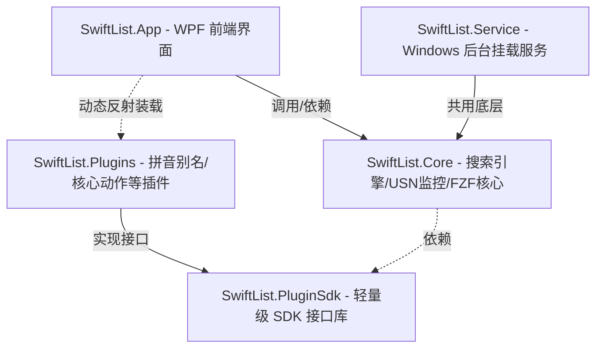

# ⚡ SwiftList

简体中文 | [English](README.md)

SwiftList 是一款基于 **.NET 10.0 (WPF)** 开发的超轻量、极速且高度可扩展的 Windows 桌面全局搜索与效率启动工具，旨在成为 **Everything** 和 **Listary** 的现代化、高颜值、支持深度定制的开源替代方案。

它通过读取 NTFS 分区的 **USN Journal（更新序列号日志）**，实现了类似 Everything 的毫秒级本地文件索引与秒级全盘检索能力，并辅以高度流畅的交互体验和高度解耦的插件体系，为 Windows 平台开发者和重度系统用户提供极致流畅的全局办公加速体验。

---

## 🚀 核心技术与产品特性

### 1. ⚡ 毫秒级全盘检索与增量同步
* **NTFS USN 日志级检索**：直接通过底层的 Win32 API 读取 NTFS 文件系统的 USN 序列日志，彻底免去传统逐个文件递归扫描（Directory Walking）所带来的巨大 I/O 消耗与漫长等待，建索引只需数秒。
* **低功耗实时后台监控**：独立 Windows 后台服务 `SwiftListService` 负责监听 USN 变化，当文件被增删改移时，索引库在后台零感完成增量毫秒级同步，内存占用极低。
* **企业级网络驱动器索引**：专为网络驱动器（NAS / 局域网共享盘）深度定制了 Walk 文件树扫描器，支持智能并行扫描和自研的高效 Glob 排阻编译器（将 Glob 表达式动态编译为高效 Regex），排除规则支持即时修改并即时生效。

### 2. 🎯 FZF 模糊匹配与拼音首字母检索
* **深度移植 FZF 匹配算法**：深度移植了著名的 FZF 核心模糊匹配与评分算法，支持多关键词模糊跳配，确保搜索结果随心而动、智能排序。
* **全汉语拼音及首字母缩写检索**：内置高效的 TinyPinyin 分词与首字母映射存储索引。例如：输入 `xx` 或 `xuexi` 即可瞬间秒搜“学习材料.xlsx”，完美适应中文搜索习惯。
* **高精度 DP 动态高亮反馈**：应用基于动态规划（DP）和最佳匹配权重回溯的智能字符高亮渲染器，精准标红用户模糊打入的离散字符，视效极其细腻。

### 3. ⚡ 硬件级 SIMD 向量化加速
* **FZF 匹配范围定位加速**：使用 Span 与 SIMD-accelerated 字符检索 API 代替原本的标量字符循环，Fuzzy Scope 计算提速达 **9.9x**。
* **Top-N 淘汰堆优化**：将原本的 AoS（`List<FzfRank>`）重构为缓存友好的 SoA 结构，并使用 `Vector256.GreaterThan` 和条件选择（`ConditionalSelect`）并行查找最差节点，提速 **1.2x - 1.3x**。
* **三百万级候选掩码过滤**：在全局文件匹配扫描（Name Contiguous Filter）中应用 AVX2 并行块扫描与掩码重载别名加速，在 300 万级别的文件量下，高选择性查询提速 **1.6x - 2.1x**。
* 更多架构设计与技术实现细节请参考：[ARCHITECTURE.md](ARCHITECTURE.md)。

### 4. 🖥️ 三合一多维度交互视图
* **快速搜索窗口 (QuickSearchWindow)**：经典轻量的主流启动器面板。支持快捷呼出（**双击 Ctrl 键**），支持快捷键徽标（如 `Ctrl+1` 至 `Ctrl+9`）极速盲操选中。
* **内联上下文挂载窗口 (InlineSearchWindow)**：极为创新的“贴靠挂载”模式。可智能检测并直接贴合挂载在 Windows 资源管理器窗口（Explorer）、各类系统文件选择/保存对话框或第三方通用列表控件的上方，按下 `Tab` 即可实现快速跳转、多屏协同与目录穿梭。
  * **现代资源管理器原生支持**：深度优化 Windows 10/11 的 Low-Level 键盘钩子，完美适配 `DirectUIHWND`、`SHELLDLL_DefView` 等现代与传统 Explorer 核心视图区焦点。
* **控制面板与系统设置 (SettingsWindow)**：提供全面的可视化控制。包含排除规则管理、网盘配置管理、后台服务监视器等。

### 5. 🔍 列表多列数据检索支持
* **`SysListView32` 与 `ListBox` 内联搜索**：可无缝拦截与贴靠原生的 standard `SysListView32`（如 Windows 任务管理器、服务列表等）和 `ListBox` 控件。
* **多列文本合并检索**：自动读取目标列表视图的所有列数据，在后端使用 Tab (`\t`) 制表符拼接，支持拼音与模糊匹配跨列同时检索（例如在任务管理器中，输入用户名 `admin` 或 PID `29560`，即可秒级筛选出对应的进程条目）。
* **精致多列分隔展示**：WPF 端自定义数据模板，通过 `SplitColumnsConverter` 对制表符字符串进行安全分割，并在 UI 上渲染出高端大气的横向 `ItemsControl` 分隔符 (`  │  `)。
* **Shift + 滚轮横向滚动**：针对超出容器宽度的多列文本，系统自动展示横向滚动条，并支持通过 Shift + 滚轮 触发横向平移，体验极佳。

### 6. 👁️ 模块化文件极速预览 (File QuickLook)
* **即时文件内容预览**：支持对文件夹、图片、文本文件及 PE 二进制程序进行无缝即时内容预览，无需拉起外部臃肿的编辑器。
* **智能焦点联动**：可在“快速搜索窗口”（`QuickSearchWindow`）与“完整检索窗口”（`SearchWindow`）中随光标选中项自动渲染或隐去预览框，遇到不支持的项目（如应用、分类标题、空项等）自动关闭，切回有效文件时自动恢复。
* **自定义功能键激活**：支持按下 `功能快捷修饰键 + Space` 或 `功能快捷修饰键 + P` 一键开关/切换预览窗口。修饰键可在设置中由用户自定义（如 Alt 或 Ctrl 等）。
* **流畅横向平移**：文本预览器支持 `Shift + 鼠标滚轮` 对过宽的日志或代码文件进行流畅的横向滚动平移。

### 7. 🛡️ 焦点安全防干扰与 UAC 提权屏蔽
* **UAC 弹窗屏蔽**：当系统弹出 UAC 提权对话框并处于前台时，自动屏蔽所有全局热键与内联挂载，确保安全。
* **智能输入焦点检测**：自动检测当前前台窗口中是否有文本输入焦点（如 `Edit`, `RichEdit` 或各类自定义 TextBox），或是否存在活动光标（Caret）。若有，则自动跳过键盘事件拦截，完美防止对正常打字造成干扰。

### 8. 🎨 动态主题与全球化 (i18n) 插件系统
* **动态多主题切换**：支持通过 `IThemeProvider` 插件注入不同视觉风格（目前已内置多种精美的高对比度与柔和设计主题），并且支持全自动扫描和无闪烁动态加载。所有图标和前景色均支持动态绑定与主题跟随。
* **完全全球化翻译支持**：支持 `ITranslationProvider` 实现完全动态的语言资源字典加载（如简体中文 `zh-CN`、英文 `en-US`），系统能基于当前系统区域或用户偏好语言自动切换界面文本。

### 9. 🧩 高度解耦的插件化生态
SwiftList 拥有极度轻量与高复用性的 **Plugin SDK**，支持三方无缝扩展，目前已内置五大类核心插件：
* **`ISearchResultAction`（动作菜单插件）**：定义文件搜索项的二级右键/Tab操作行为。如：“打开所在文件夹”、“复制文件路径”。同时内置了专属于内联挂载窗口的命令。
* **`IDynamicActionProvider`（动态上下文菜单）**：与 Windows Shell 深度集成，完美在 WPF 中像素级重现 Windows 系统右键快捷菜单。
* **`IInstantResultProvider`（实时查询求值插件）**：
  * **全能科学计算器**：实时拦截纯数字/代数输入，内置强大数学解析引擎。支持进制互转与混算（如 `255 to hex` 👉 `0xFF`），按 `Tab` 键直接将计算结果填充至输入框。
  * **Windows 环境变量解析器**：实时识别并展开 Windows 环境变量路径（如 `%appdata%`），物理路径存在时回车直接拉起资源管理器，不存在时自动回退为一键复制。
  * **系统命令执行器 (Command Runner)**：实时执行系统 Shell 命令。
  * **Bing 智能翻译/字典**：输入 `tr hello` 或 `tr 你好`，直接在结果面板上渲染翻译结果和源语言。回车或单击即可复制结果。源语言自动选择，且能智能识别当前应用界面语言进行翻译。当源语言与目标语言相同时，自动反向翻译为英文。
  * **网页快捷搜索**：输入特定前缀和关键字，回车即可自动在默认浏览器中打开搜索结果。目前支持：`gg <keyword>` (Google)、`bd <keyword>` (百度)、`bing <keyword>` (Bing)、`gh <keyword>` (GitHub)、`wiki <keyword>` (维基百科)。

---

## 📖 详细使用说明手册

### 1. 呼出与基本交互
* **唤醒搜索框**：在系统任意界面下，**快速双击 `Ctrl` 键**即可在屏幕中央唤醒“快速搜索窗口”。再次双击 `Ctrl` 键或按 `Esc` 键即可将其隐藏。
* **极速盲操选择**：
  * 搜索结果列表右侧会常驻 `Ctrl+1` 到 `Ctrl+9` 的快捷徽标。
  * 您无需使用鼠标，只需按下对应的 `Ctrl+数字` 即可一键直接激活并运行对应位置的搜索结果。
* **复制文件实体 (Ctrl+C)**：在任何搜索窗口的结果列表中选中文件或目录，按下 `Ctrl+C` 键即可将该文件/文件夹实体直接复制到系统剪贴板并**自动关闭搜索窗口**，您可以在资源管理器中直接 `Ctrl+V` 进行粘贴复制操作。
* **二级菜单 (Actions Menu)**：
  * 选中某条搜索结果后，按下 `Tab` 键或点击右键，即可拉出针对该文件的动作菜单。
  * 支持 “打开文件”、 “打开所在文件夹”、 “以管理员身份运行”、 “复制文件路径”、 “复制文件” 等高频操作。

### 2. 内联资源管理器挂载与目录穿梭 (Inline Search)
内联挂载窗口是 SwiftList 最具效率的创新特性，能够将搜索工具与系统原生资源管理器窗口直接融合：
* **智能贴合**：当您打开任何 Windows 资源管理器（Explorer）或各类软件的“打开文件 / 保存文件”对话框时，SwiftList 会自动以极其轻量的形式横向“贴靠挂载”在窗口的顶端或焦点处。
* **Tab 键穿梭**：
  * 当您在资源管理器中需要进行深度目录跳转时，只需直接在内联搜索框中进行检索。
  * 选中您想去的文件夹，按下回车或 `Tab` 键，资源管理器将**瞬间平滑切换**到目标路径，彻底免去手动双击逐层寻找的烦恼。
* **保存对话框一键导航**：
  * 在浏览器下载保存文件、或办公软件导出文件弹出“保存文件”对话框时，挂载窗口依然生效。
  * 在此输入您想要存放的目标文件夹，回车即可一键将该保存对话框导航至目标位置，实现零延迟文件归档。

### 3. 输入框魔法指令与即时求值
SwiftList 允许您在同一个输入框中完成计算、路径展开以及终端指令提权调用：
* **计算器与进制转换**：
  * 输入任何数学算式（如 `(12 + 34) * 5`），输入框下方将即时计算并高亮反馈结果。
  * 输入进制转换指令（如 `1024 to hex` 或 `0xFF to dec`），可在十进制和十六进制间无缝互转。按 `Tab` 即可直接把计算结果填入输入框。
* **环境变量解析**：
  * 输入系统环境变量（如 `%temp%`、`%localappdata%`），搜索框会自动物理定位并展开真实路径。回车可直接打开，若路径不存在则自动一键复制。
* **内联目录辅助指令**：
  在内联挂载窗口处于激活状态时，在输入框中打入以下命令并回车，可在**当前资源管理器的活动目录下**直接创建文件或目录：
  * `touch <filename>`：快速在当前工作目录下新建一个空白文件（如 `touch index.js`）。
  * `mkdir <foldername>`：快速在当前工作目录下新建文件夹（如 `mkdir src`）。
* **终端快捷命令执行器 (Command Runner)**：
  * **普通权限执行 ($)**：输入 `$<command>`（如 `$ping google.com`），系统将以普通用户权限执行该指令，并在执行完毕后停留在 CMD 界面供您查看输出。
  * **管理员提权执行 (#)**：输入 `#<command>`（如 `#net start mssqlserver`），系统会自动弹出 UAC 提权并以管理员权限执行命令，执行后停留在 CMD 界面。

### 4. 文件极速预览 (File QuickLook)
* **唤起预览**：在列表中选中任意文件或文件夹，按下 `功能快捷修饰键 + Space` 或 `功能快捷修饰键 + P`（例如，若功能修饰键设为了 Alt，则按 `Alt + Space`）即可拉出精致的侧边栏 QuickLook 预览窗口。
* **光标随动更新**：预览开启后，上下移动光标切换选中文件，预览内容会实时联动更新。如果切换到不支持预览的条目，预览窗口会自动隐藏；当再次切回支持预览的文件时，它将自动恢复显示。
* **模块化与可配置性**：所有预览器均作为插件形式加载。您可以在“插件管理”设置页中查看、启用或禁用特定的预览提供者（如文件夹预览器、图片预览器、文本预览器、PE 预览器）。

### 5. 自动更新与静默升级
* **自动检查更新**：在通用设置中开启该功能后，App 每次启动时会在后台静默请求最新的 GitHub Release 资产。
* **自动静默更新 (Auto Silent Update)**：
  * **配置限制**：出于系统安全性及服务权限考虑，**非管理员用户无法配置和开启自动静默更新**，该开关在非管理员权限下将置灰禁用。
  * **静默更新前提示**：为防打扰用户当前工作，在执行静默更新前，系统会自动弹出确认框提示用户，用户同意后才会拉起更新流程。
  * **进程热杀守护顺序**：为了防止文件占用引发升级失败，更新批处理（`portable-updater.bat`）会严格按照：**结束主客户端 App 进程 ➔ 结束 Hook Service 钩子进程 ➔ 提权注销并停止后台 `SwiftListService` 系统服务**的闭环顺序平滑终结全部进程，释放文件锁后应用文件覆盖，最后重装并重新唤醒后台服务及客户端。

---

## 🛠️ 项目架构设计

项目采用高度解耦的工程分层体系：

* **`SwiftList.slnx`**：主程序工程解决方案（包含 App, Core, Service, PluginSdk）。
* **`SwiftList.Plugins.slnx`**：插件体系开发解决方案（包含三方及核心插件项目）。

---

## ⚡ 开发者指南

### 1. 开发环境要求
* **操作系统**：Windows 10 / 11 (由于 USN 读写限制，不支持非 Windows 平台)
* **开发工具**：Visual Studio 2022 / JetBrains Rider
* **运行运行时**：.NET 10.0 SDK (WPF)
* **打包依赖**：NSIS (Nullsoft Scriptable Install System)（若需生成安装包）

### 2. 编译与运行一键脚本
项目根目录下提供了两个核心批处理脚本，极大简化了编译与调试步骤：
* **`build_and_run.bat`**：
  * 一键结束所有正在运行的 SwiftList 实例和相关 Hook 挂载进程。
  * 热注销并停止旧的服务。
  * 自动重新编译主程序与所有插件。
  * 重装并重启 Windows 服务，平滑拉起前端客户端 App。
* **`make.bat`**：
  * **干净构建 (Clean Build)**：启动时自动清理并删除 `dist/` 和 `publish/` 目录，防旧文件残留。
  * **动态版本提取**：自动读取 `App/App.csproj` 中最新的项目版本号，转换成 Windows PE 兼容 of 4 位版本字符串并传参编译。
  * **Release 自动发布**：在 Release 模式下发布主程序、服务和插件，剔除 pdb 文件，并调用 NSIS 编译器编译模块化安装脚本（[Installer/installer.nsi](Installer/installer.nsi)）。
  * **依赖检测与静默安装**：NSIS 安装器在安装时会自动检测本地 .NET 10.0 Windows Desktop Runtime 环境。若缺失，会通过后台服务（BITS，若失败则回退至 curl）自动静默下载并静默执行安装（`/install /quiet /norestart`），无需用户手动下载。
  * **成品打包输出**：将最终打包的绿色压缩包存入 `dist/SwiftList-Portable.zip`，并将安装包存入 `dist/SwiftList-Setup.exe`。
  * **收尾临时清理**：打包成功后自动清空删除 `publish/` 临时发布目录。

---

## 🎁 捐助与支持

如果您觉得 SwiftList 对您有帮助，非常感谢您的支持和赞助！

* **Tether USDT (TRC20)** 收款地址：
  `TNDh3husX1trDW2ZPm4ZZYdoCoCRCZQXn5`

---

## 📜 许可证

本项目基于 **MIT License** 许可协议开源。
