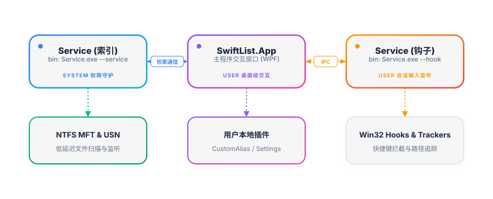

# 架构设计

SwiftList 采用 **“索引服务常驻后台 + 钩子进程拦截输入 + 应用进程呈现交互”** 的多进程分离架构。

## 进程职责划分

### SwiftList.Service (索引模式 - SYSTEM 权限)
* **职责**：后台极速索引扫描器。
* 负责扫描本地磁盘 MFT 记录并实时监控 USN Journal。
* 内存中常驻 `RuntimeIndex` 结构，提供最高速的路径匹配。
* 向 App 提供命名管道（Named Pipe `"SwiftListPipe"`）通信服务。
* **多用户共享**：数据库和内存结构系统唯一。

### SwiftList.Service (钩子模式 - 用户权限)
* **职责**：系统级全局输入与焦点监听器（通过 `Service.exe --hook` 运行）。
* 负责注册 Windows 全局键盘快捷键（Keyboard Hooks）拦截，触发快速唤醒。
* 追踪当前焦点窗口类型（Win32 Hooks）并动态搜集活跃路径（如 Explorer、Terminal 物理路径）。
* 向 App 提供本地命名管道连接，实现系统按键消息的低延迟回传。
* **单用户会话绑定**：在每个登录用户的独立 Windows 会话中独立启动和运行。

### SwiftList.App (用户权限)
* 提供轻量化的 WPF 搜索框，处理用户输入与界面呈现。
* 向 Service 发送 `SearchRequestMessage` 查询指令，并通过 `AsyncLocal` 的查询上下文返回给各用户定制的检索结果。
* 加载用户启用的插件，如自定义别名扩展插件等。